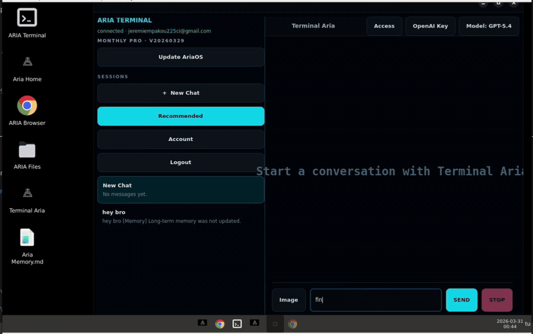

# AriaOS -  Agents Computer Use

<p align="center">
  
  
  
  
</p>

An agent-focused operating system that runs inside a dedicated virtual machine, with Terminal Aria, local files, local OpenAI key setup, local voice mode, and visible long-term memory.
The project started as an attempt to answer a simple question: what happens if an AI agent is given control of an operating system, including sudo, browser navigation, file access, and UI interaction, but is isolated inside its own VM? AriaOS is that answer. The VM is the product, the repo now exposes the readable local brain that runs inside it, and the public build keeps the main path local-first.

<p align="center">
  <a href="https://getariaos.com/download">
    
  </a>
</p>

## 🚀 Features

- 🤖 **Agent-focused OS** - A dedicated environment for running and operating an agent inside a VM
- 💻 **Terminal Aria** - A work surface centered on agent-driven execution
- 🖱️ **Computer Use** - The agent can see the screen, move the mouse, click, type, scroll, and verify desktop/browser results inside the VM
- 🔐 **OpenAI BYOK** - Users provide their own OpenAI API key on first launch
- 🗂️ **Local Workspace** - Files, history, and memory stay inside the VM
- 🧠 **Visible Local Brain** - The repo now exposes the local VM brain, its prompts, and its agentic loop
- 🎙️ **Local Voice Mode** - Microphone input, transcription, TTS, and task start/stop all run inside the VM
- 🧾 **Long-Term Memory** - Aria keeps a readable Markdown memory file plus a local semantic index for summary recall
- ⏳ **Future-Task Brain Contract** - The planner already understands scheduling, cancellation, updates, and replacements for later tasks
- 🖥️ **Integrated Desktop** - Browser, files, and shell run inside the same machine

## ⚡ Quick Start

```bash
# Clone the repository
git clone <your-repo-url> ariaos
cd ariaos

# Run the GTK shell locally
cd app/aria-shell-gtk
PYTHONPATH=src python3 -m aria_shell_gtk
```

For the actual product experience, the intended path remains the preconfigured AriaOS VM. This public repository contains the shell codebase, VM guest files, and VM release tooling.

## 📦 VM Download

- **Latest VM release page** - [Download the latest AriaOS VM](https://github.com/jeremie225ci/ariaos/releases/latest)
- **Direct OVA download** - [Download AriaOS (.ova)](https://getariaos.com/api/downloads/ova)
- **Direct QCOW2 download** - [Download AriaOS for UTM (.qcow2)](https://getariaos.com/api/downloads/mac)
- **Download page** - [AriaOS VM downloads](https://getariaos.com/download)
- **External mirror** - If the VM grows beyond GitHub's per-file release limit, keep the canonical download on your own server/CDN and point the release page here

### macOS / UTM

- **Mac Intel** - Use UTM and import the published `.qcow2` image. This is the recommended macOS path.
- **Mac Apple Silicon** - The current public VM is still `x86_64`. Use UTM with emulation. It can work, but boot and runtime will be slower than on Intel Macs.
- **ARM-native status** - A native Apple Silicon / ARM build is not published yet.

## 📖 Usage

### First Run

1. Boot the AriaOS VM
2. Let the first boot create the local `aria` user automatically
3. Wait for the VM to reboot into the desktop session
4. Open AriaOS / Aria Home
5. Enter an OpenAI API key
6. Launch Terminal Aria

### Main Flow

- **Aria Home** - Main entry point
- **Terminal Aria** - Task execution interface
- **OpenAI Key** - Local API key and model setup
- **Files** - Access to the local workspace
- **Browser** - Navigation inside the VM

### Current Direction

The public AriaOS flow is now **local-only**:

- no mandatory account creation
- no mandatory remote server dependency for first use
- OpenAI API key stored locally inside the VM
- embedded local runtime as the only supported execution path

## 🧠 Brain Runtime

If you want to understand what the public AriaOS brain can actually do, read:

- `docs/BRAIN_ACTION_SURFACE.md` - planner contract, `computer` loop, desktop helpers, file/programming actions, and runtime guard rails
- `docs/KERNEL_AND_SURFACE_MAP.md` - real kernel-level input module, old obfuscated name mapping, and the readable UI surfaces now exposed publicly
- `docs/KERNEL_AUDIT.md` - audit of the actual VM kernel, the older `Ariaos/kernel` tree, the `/dev/uinput` path, and the real boot-branding layer
- `docs/LOCAL_FIRST_ARCHITECTURE.md` - local runtime topology inside the VM
- `docs/LONG_TERM_MEMORY.md` - readable memory file, local SQLite embedding index, recall, and write path
- `docs/VM_SLIMMING_AUDIT.md` - what makes the VM heavy today, what can be removed safely, and what must stay for the public release
- `docs/VOICE_MODE.md` - local voice websocket flow, transcription, TTS, and task control
- `docs/FUTURE_TASKS.md` - current future-task planner contract and what is still missing for full local scheduling
- `docs/VM_CODE_LAYOUT.md` - canonical VM code location, runtime state paths, caches, staging copies, and backups

## 🔧 Configuration

Main local files used by AriaOS:

- `~/.config/ariaos/user_secrets.json` - local OpenAI key and secrets
- `~/.config/ariaos/runtime_config.json` - runtime configuration
- `~/.local/state/ariaos/onboarding_state.json` - onboarding state
- `~/Desktop/Aria Memory.md` - readable long-term memory file
- `~/.ariaos/data/aria_memory_index.db` - local SQLite embedding index for semantic memory recall
- `~/.ariaos/data/` - local history and app data

## 🏗️ Project Structure

```text
ariaos/
├── README.md
├── backend/                      # Local backend runtime, visible brain, prompts, and voice server
├── aria/                         # Local input backend package used by the brain
├── app/
│   └── aria-shell-gtk/          # GTK shell, onboarding, home, terminal
├── vm/
│   ├── guest/                   # Launchers, desktop files, firstboot, greeter
│   └── release/                 # VM export and release tooling
├── docs/
│   ├── INSTALL_VM.md            # VM setup flow
│   ├── LOCAL_FIRST_ARCHITECTURE.md
│   ├── BRAIN_ACTION_SURFACE.md  # Planner actions, computer-use loop, and local helper/tool surface
│   ├── KERNEL_AND_SURFACE_MAP.md # Real kernel input module, old/private name mapping, and public UI surfaces
│   ├── KERNEL_AUDIT.md          # Audit of the real VM kernel, boot-branding path, and upstream kernel checkout
│   ├── VM_SLIMMING_AUDIT.md     # What makes the VM heavy and which components can be removed safely
│   ├── LONG_TERM_MEMORY.md      # Markdown memory file, semantic recall, and local vector index design
│   ├── VOICE_MODE.md            # Local voice websocket flow and speech stack
│   ├── FUTURE_TASKS.md          # Scheduler contract and current local scheduler status
│   └── VM_CODE_LAYOUT.md        # Canonical VM source location vs state/cache/staging directories
└── assets/                      # Shared repository assets
```

## 🛡️ Security

AriaOS isolates the agent experience inside a dedicated VM:

- 🧱 **Separate perimeter** - The agent works inside the VM, not directly on the host
- 🔐 **Local key storage** - The OpenAI key stays stored locally
- 🗃️ **Visible memory** - Preferences and useful summaries remain inspectable
- 🎙️ **Local speech path** - Voice mode stays on the VM through the local websocket backends
- 🧭 **Simplified flow** - Fewer remote dependencies in the main product path

## 📋 Requirements

- Python 3
- Linux / Debian-based VM
- GTK4 + libadwaita for the GTK shell
- OpenAI API key

Common packages:

- `python3-gi`
- `gir1.2-gtk-4.0`
- `gir1.2-adw-1`

## 📄 License

Public license not finalized yet.
